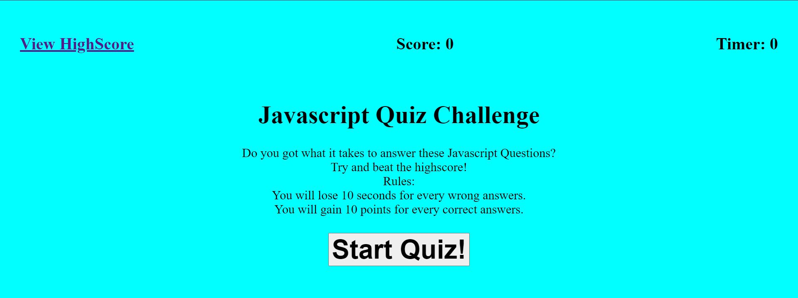
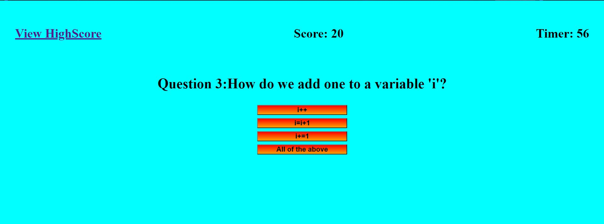
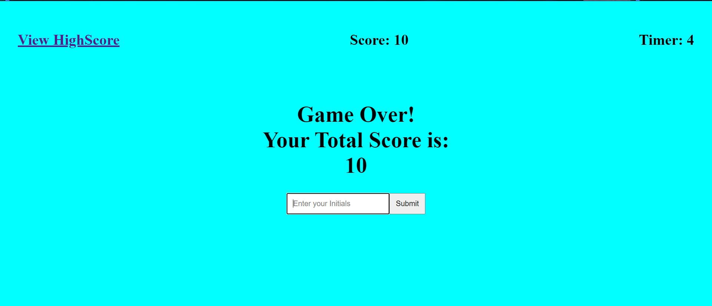
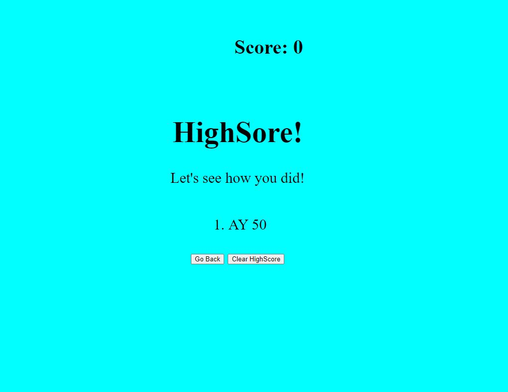

# web-quiz

## Description
Javascript Quiz!!

Test yourself to see how well you know your javascript.  
Rule: 
1) You will lose 10 seconds for every wrong answers.
2) You will gain 10 points for every correct answers.

## Table of Contents 
* [Links](#Links)
* [Instructions](#Instructions)

## Links

Repo: https://github.com/andrewyu22/web-quiz

Link: https://andrewyu22.github.io/web-quiz/

## Instructions

# Step 1

Click "Start Quiz!" to begin the quiz.

# Step 2
Answer the questions.

# Step 3 
Game Over! Save your HighScore

# Step 4
View your HighScore!

